````markdown
# 🚀 AI Job Portal

An AI-powered Job Portal built using **Django REST Framework**, **React.js**, **Redux Toolkit**, and **OpenRouter AI** that connects candidates and recruiters with intelligent recruitment features.

---

# 🌟 Features

## 👨‍💼 Candidate Features

- JWT Authentication
- Register & Login
- Resume Upload (PDF)
- AI Resume Analysis
- Resume Score
- Skill Extraction
- Apply for Jobs
- Track Applications
- AI Job Recommendations
- Mock Interview
- Resume Dashboard
- My Interviews
- Profile Management

---

## 🏢 Recruiter Features

- Recruiter Login
- Recruiter Dashboard
- Create Job
- Edit Job
- Delete Job
- View Applicants
- AI Candidate Ranking
- Schedule Interviews
- Analytics Dashboard
- Generate AI Offer Letter

---

# 🤖 AI Features

- Resume Parsing
- Resume Analysis
- Resume Score
- Skill Extraction
- AI Job Recommendation
- AI Candidate Ranking
- AI Interview Evaluation
- AI Offer Letter Generation

---

# 🛠 Tech Stack

## Frontend

- React.js
- Redux Toolkit
- React Router DOM
- Axios
- Tailwind CSS
- React Hot Toast

## Backend

- Django
- Django REST Framework
- Simple JWT
- PostgreSQL
- Cloudinary
- OpenRouter AI
- Render

---

# 📂 Project Structure

```text
AI-Job-Portal
│
├── frontend
│   ├── src
│   ├── components
│   ├── pages
│   ├── routes
│   ├── api
│   └── redux
│
├── backend
│   ├── accounts
│   ├── jobs
│   ├── applications
│   ├── resumes
│   ├── ai_engine
│   ├── analytics
│   ├── interviews
│   ├── notifications
│   ├── offer_letters
│   ├── mock_interview
│   └── config
│
└── README.md
````

---

# 🔐 Authentication

* JWT Authentication
* Role-Based Authorization
* Candidate Access
* Recruiter Access

---

# 📦 Main Modules

* Authentication
* Job Management
* Resume Management
* Applications
* AI Engine
* Analytics
* Mock Interview
* Interview Scheduling
* Notifications
* Offer Letters

---

# ⚙ Installation

## Clone Repository

```bash
git clone https://github.com/yourusername/ai-job-portal.git
```

---

## Backend Setup

```bash
cd backend

python -m venv venv
```

### Windows

```bash
venv\Scripts\activate
```

### Linux / macOS

```bash
source venv/bin/activate
```

Install Dependencies

```bash
pip install -r requirements.txt
```

Run Migrations

```bash
python manage.py migrate
```

Create Superuser

```bash
python manage.py createsuperuser
```

Run Development Server

```bash
python manage.py runserver
```

---

## Frontend Setup

```bash
cd frontend

npm install

npm run dev
```

---

# 🌍 Environment Variables

Create a **.env** file inside the backend folder.

```env
SECRET_KEY=

DEBUG=True

DATABASE_URL=

OPENROUTER_API_KEY=

CLOUDINARY_CLOUD_NAME=

CLOUDINARY_API_KEY=

CLOUDINARY_API_SECRET=
```

---

# 📸 Screenshots

## 🏠 Home Page

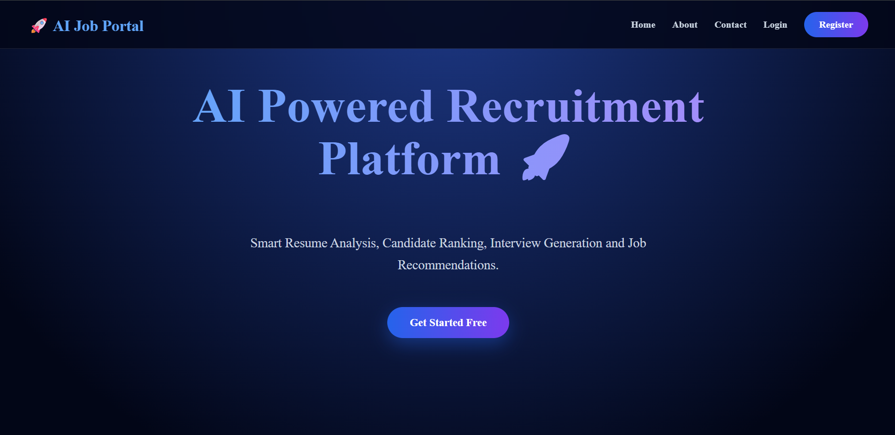

---

## 🔐 Login

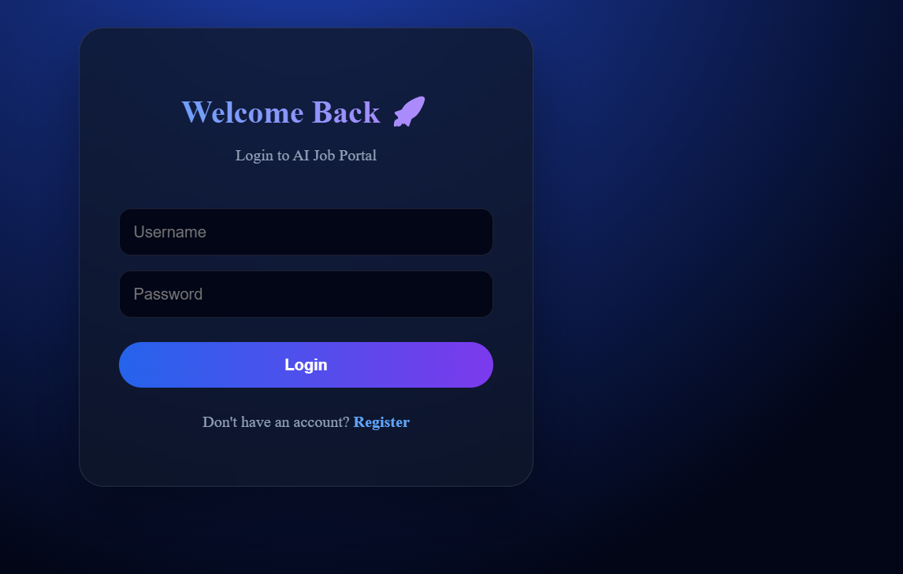

---

## 📝 Register

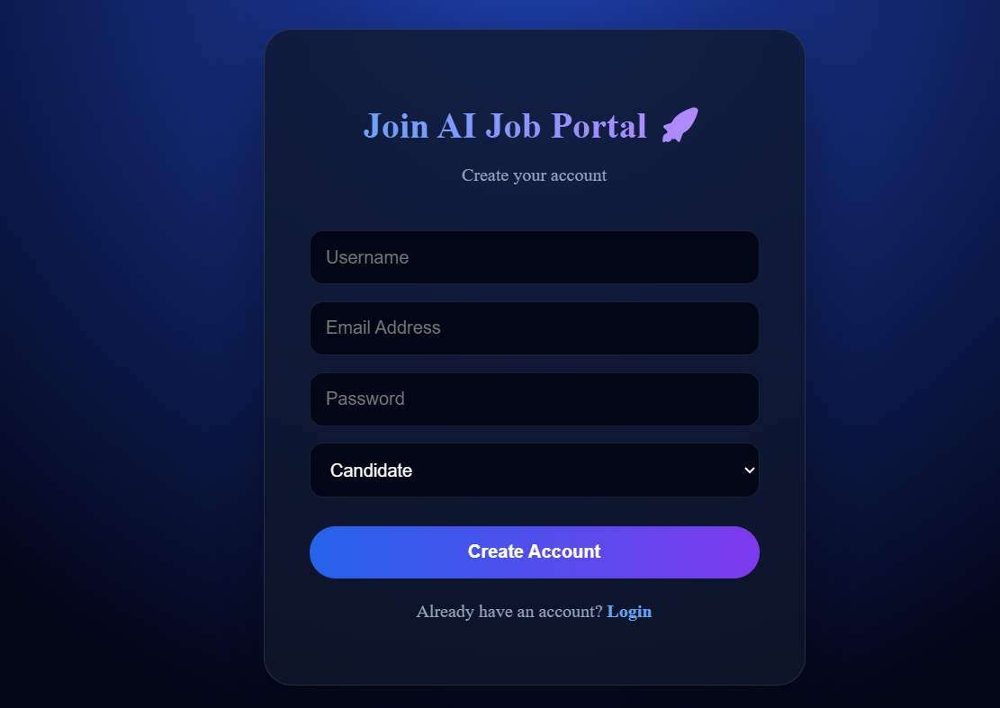

---

## 👨‍💼 Candidate Dashboard

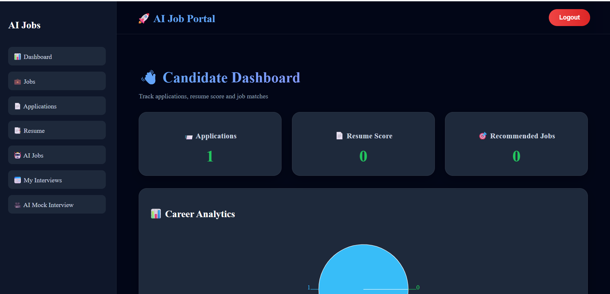

---

## 🏢 Recruiter Dashboard

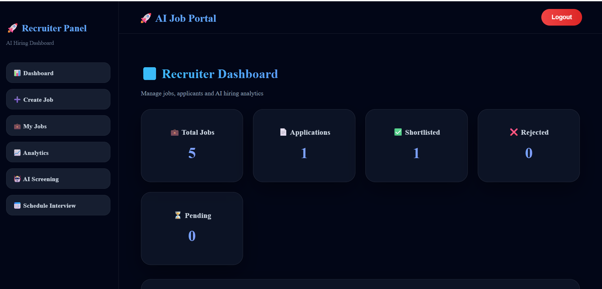

---

## 💼 Job Listings

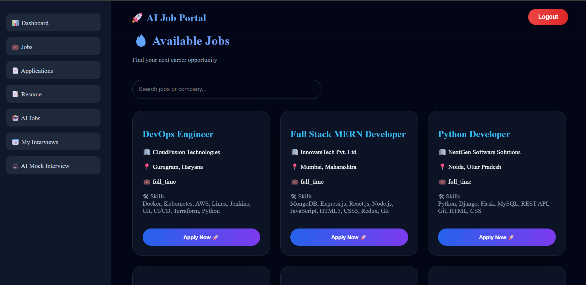

---

## ➕ Create Job


---

## 📄 My Jobs

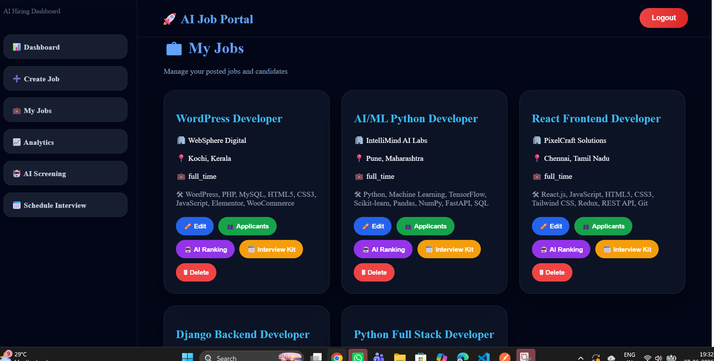

---

## 📑 Resume Dashboard

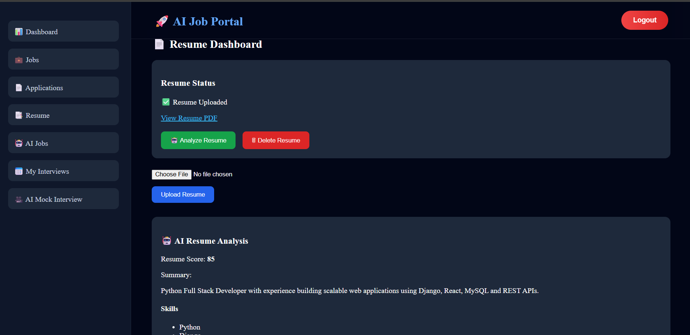

---

## 🤖 AI Resume Analysis

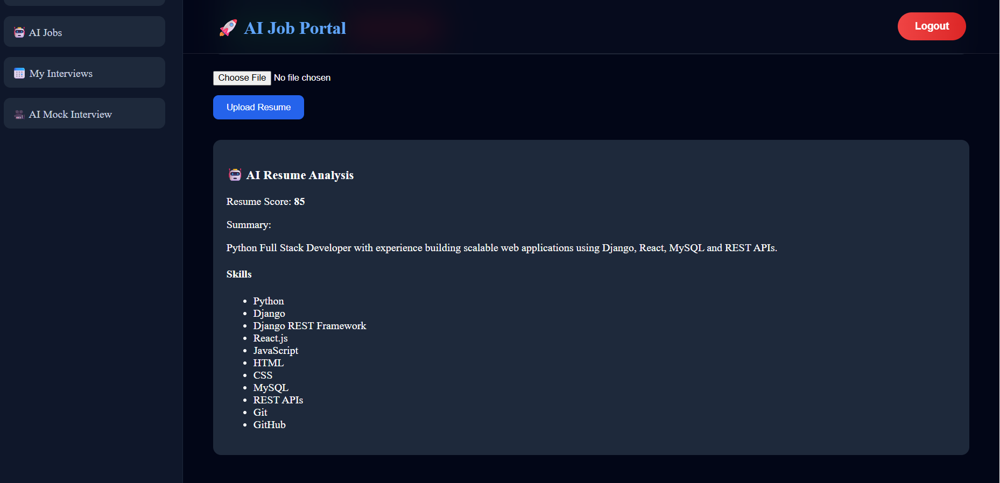

---

## 🎯 AI Candidate Screening

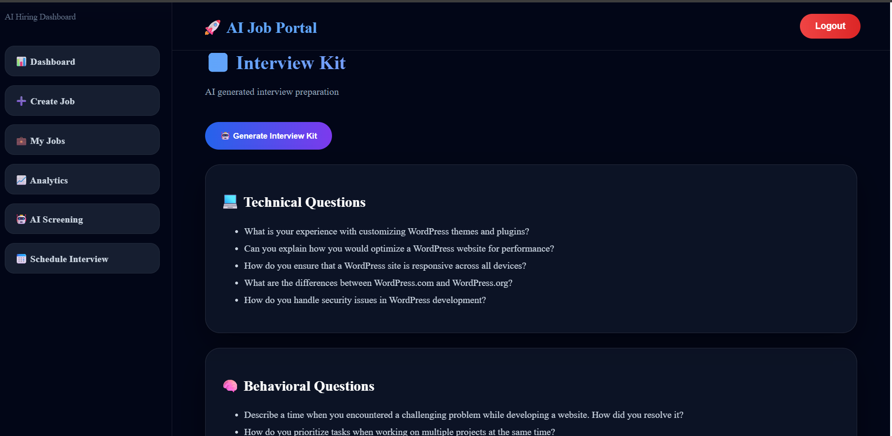

---

## 🎤 Mock Interview

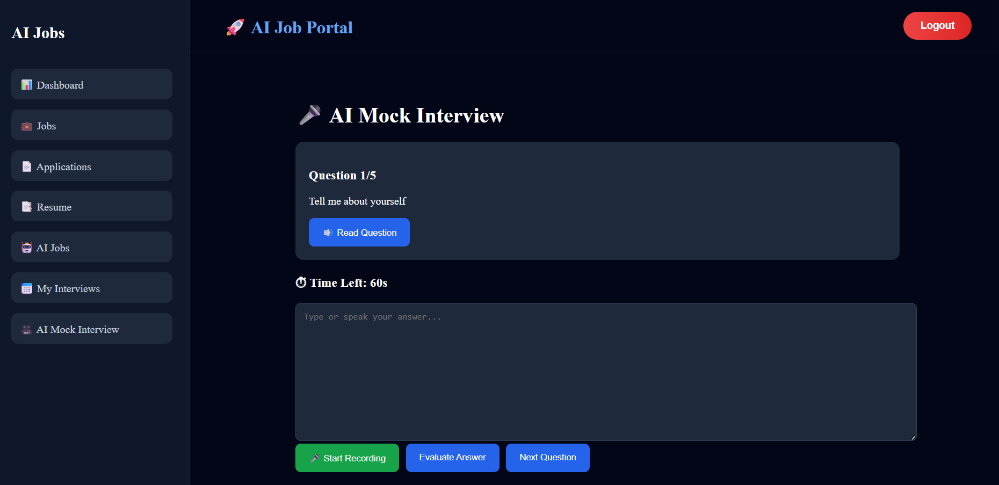

---

## 📅 My Interviews

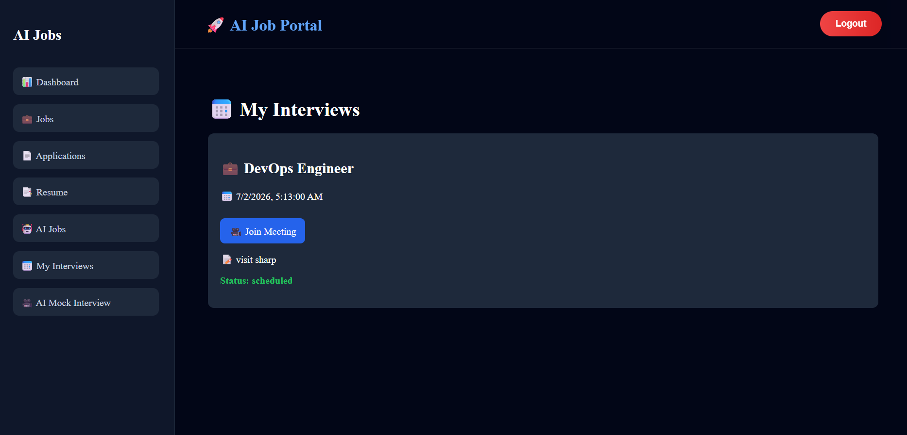

---

## 📊 Analytics Dashboard

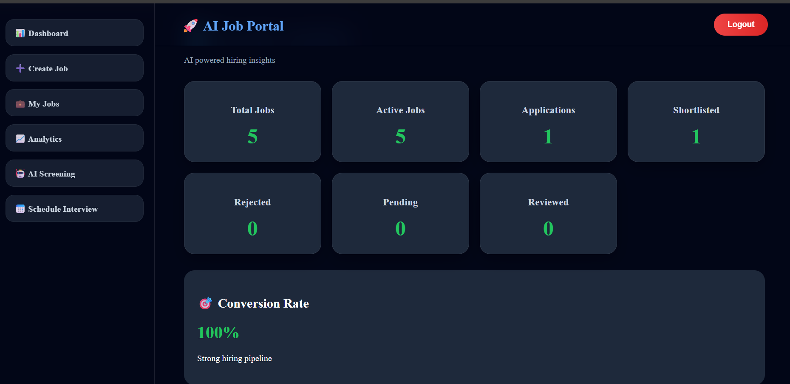

---

## 💡 Recommended Jobs

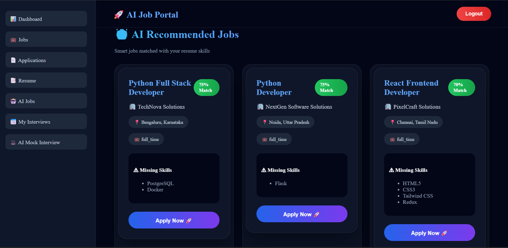

---

## 📌 My Applications

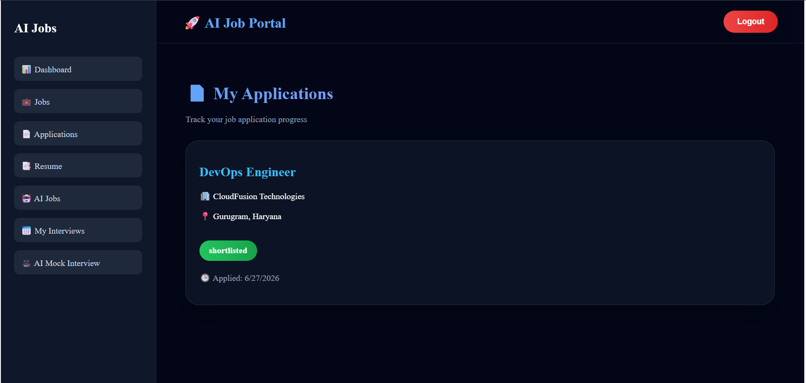

---

## 📄 Offer Letter

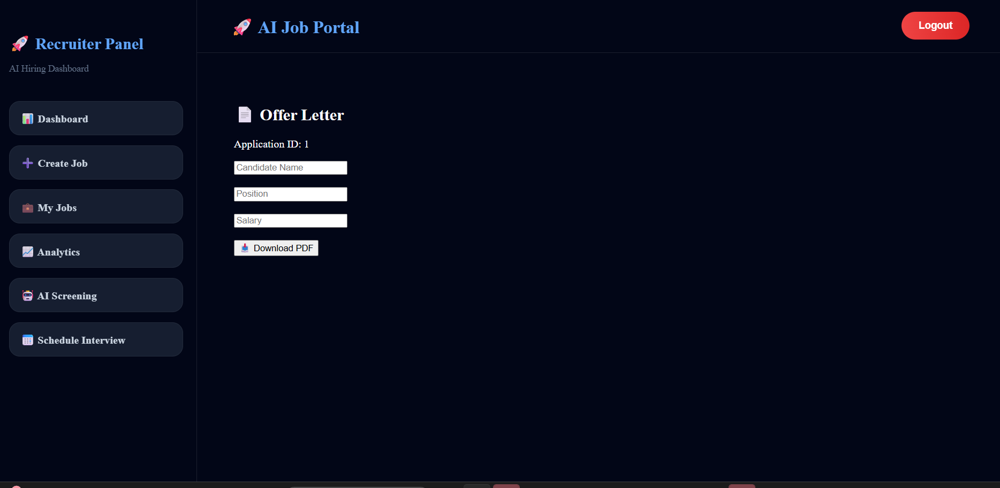

---

## 📚 Swagger API

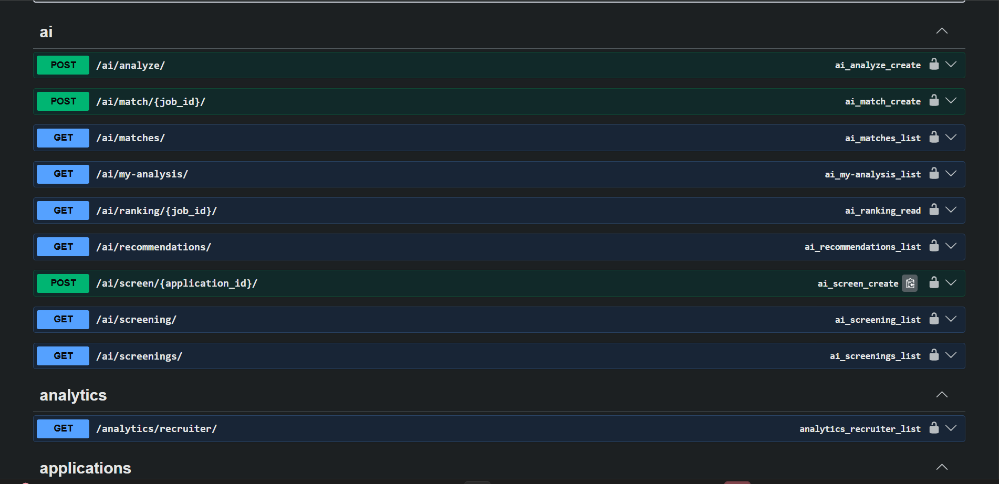

---

## 🏗 System Architecture

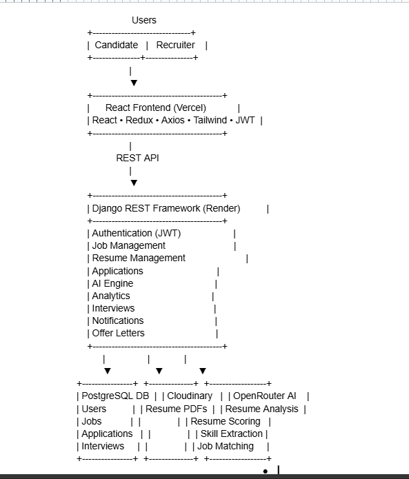

---

# 🚀 API Endpoints

## Authentication

```
POST   /api/auth/register/
POST   /api/token/
POST   /api/token/refresh/
GET    /api/auth/profile/
```

## Jobs

```
GET    /api/jobs/
POST   /api/jobs/create/
PUT    /api/jobs/{id}/
DELETE /api/jobs/{id}/
```

## Resume

```
POST   /api/resumes/upload/
GET    /api/resumes/me/
DELETE /api/resumes/delete/
```

## Applications

```
POST   /api/applications/apply/
GET    /api/applications/my-applications/
```

## AI

```
POST   /api/ai/analyze/
GET    /api/ai/recommendations/
GET    /api/ai/ranking/
```

---

# 🚀 Deployment

### Frontend

* Vercel

### Backend

* Render

### Database

* PostgreSQL (Neon)

### File Storage

* Cloudinary

---

# 🔮 Future Enhancements

* Video Interview
* Email Notifications
* Resume Builder
* Live Chat
* Company Reviews
* Salary Prediction
* AI Career Guidance
* Calendar Integration

---

## 👨‍💻 Author

| | |
|---|---|
| **Name** | Arunima S |
| **Role** | Python Full Stack Developer |
| **Live Demo** | https://ai-job-portal-f52vecpg6-arunimas-projects-140d0a2a.vercel.app/ |
| **GitHub Repository** | https://github.com/Arunimatechy/ai-job-portal |
| **GitHub Profile** | https://github.com/Arunimatechy |
| **LinkedIn** | https://linkedin.com/in/arunimaSaru |

# ⭐ Support

If you like this project, don't forget to give it a ⭐ on GitHub!

```
```
